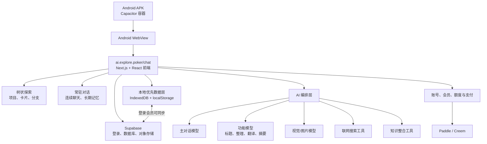
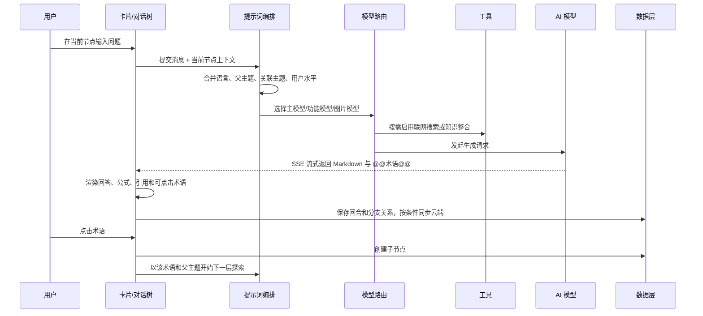

# Explore APK 代码逻辑与产品架构拆解

分析对象：`Explore.apk`  
分析日期：2026-07-28  
APK SHA-256：`2953A85CB44D33C78209F3442B7C6D53D54ECDE775C95DECA103926111116A07`

## 一句话结论

Explore 不是把主要业务代码装进 APK 的传统 Android App，而是一个约 3 MB 的 **Capacitor 网页容器**。Android 端只负责打开远程网页、处理键盘/状态栏/震动和生命周期；真正的产品、AI 对话、树状探索、模型选择、会员和支付逻辑都在 `https://ai.explore.poker/chat` 的远程 Next.js 前端及其后端服务中。

产品本质可以概括为两个互补模式：

> “树状探索”把普通 AI 聊天改造成可从任意术语继续向下追问的知识地图；“常驻对话”保留连续聊天和分层长期记忆。两者都可以把用户确认过的理解沉淀进个人“思维宇宙”。

## 1. APK 基本信息

| 项目 | 结果 |
|---|---|
| App 名称 | Explore |
| 包名 | `poker.explore.ai` |
| 版本 | `1.1`，versionCode `2` |
| APK 大小 | 3,128,122 字节，约 2.98 MiB |
| 最低 Android | Android 7.0，API 24 |
| 目标 Android | API 36 |
| 主入口 | `poker.explore.ai.MainActivity` |
| 签名 | APK Signature Scheme v2 |
| 签名主体 | `CN=Hengda Zheng, OU=Explore` |
| 签名有效期 | 2026-07-04 至 2051-06-28 |

主入口 `MainActivity` 没有业务代码，只继承了 Capacitor 的 `BridgeActivity`：

```text
MainActivity
└── BridgeActivity
    └── WebView + JavaScript/原生能力桥接
```

这意味着重新做一个功能近似版本时，重点不是反编译 Android Java/Kotlin，而是重建远程 Web 产品及其后端。

## 2. 整体技术架构



### Android 原生层

已确认使用 Capacitor，包含四个插件：

- App：应用生命周期、返回键、前后台状态等。
- Haptics：震动反馈。
- Keyboard：软键盘行为。
- Status Bar：状态栏样式。

APK 只申请：

- 网络访问；
- 震动；
- 一个 AndroidX 内部动态广播保护权限。

没有相机、麦克风、定位、通讯录、短信、存储等敏感权限，也没有自定义后台 Service。

### Web 前端层

远程页面已确认使用：

- Next.js App Router；
- React；
- Zustand 状态管理及持久化；
- Dexie/IndexedDB 本地数据库；
- Supabase Auth、Postgres 数据同步和对象存储；
- Tailwind 风格的工具类 CSS；
- 响应式移动布局；
- Markdown、KaTeX 公式、表格、代码、图片和文档内容渲染。

Capacitor 官方将 `server.url` 定义为给实时重载服务器使用，并明确注明不建议用于生产环境；Explore 正是通过这个配置直接加载远程正式站点。[Capacitor 配置说明](https://capacitorjs.com/docs/config)

## 3. 产品信息架构

从系统提示词、数据结构、接口调用、样式语义和模型配置可以还原出完整的产品结构。

### 3.1 对话与探索层

核心不是一条从上到下的消息流，而是“对话回合树”：

- 用户先提出一个主题；
- AI 回答中的专业名词会被特殊标记；
- 标记后的名词在界面中变成可点击、带下划线的文本；
- 用户点击某个名词后，从该位置创建下一层对话；
- 新分支自动携带父层主题或关联主题；
- 用户可以在不同分支间切换、折叠、收藏或继续追问。

样式表中存在明确的 `tree-path`、`tree-link`、`tree-node-current`、`tree-node-active`、`card-up/down`、`collapse-turn`、`favorite` 等语义变量，说明“树 + 回合卡片”不是文案概念，而是实际 UI 模型。

### 3.2 智能标记层

系统要求模型把概念、理论、术语、缩写输出为：

```text
@@量子力学@@
```

前端再把 `@@...@@` 解析成用户可点击的术语。用户看不到 `@@` 本身，只看到带交互状态的词。

这是 Explore 最关键的产品机制：

```text
AI 输出文本
→ 识别 @@术语@@
→ 渲染成可点击词
→ 点击后创建子探索
→ 给子对话补充父主题上下文
```

### 3.3 上下文编排层

子对话不是简单复制整段聊天，而是给模型注入结构化背景：

- `background_topic`：表示当前问题来自某个父主题，需要在该范围内解释；
- `related_topic`：表示用户从某主题联想到新话题，需要判断关联程度；
- 用户熟悉领域；
- 用户知识水平；
- 用户指定语言；
- 联网搜索开关；
- 自动引用设置。

因此，它的核心 AI 工程不是单一提示词，而是一个“根据当前树节点动态拼装提示词”的上下文编排器。

### 3.4 知识沉淀层

代码中的产品规则把“知识整合”设计得比较克制：

- 只有用户用自己的话表达理解；
- 且理解被判断为正确、完整；
- 才允许调用 `knowledge_integrate`；
- 如果个人知识体系里已有相似理解，则避免重复写入。

产品口径把这一知识体系称为“思维宇宙”。客户端实现并不是纯粹的远程向量数据库：

- 每条知识保存文本、分类和 embedding；
- 当前问题先请求 `/api/knowledge` 的 `embed` 操作得到向量；
- 客户端在本地计算余弦相似度，取最多 3 条、相似度不低于 0.65 的知识；
- 命中的内容以 `<retrieved_related_insights>` 注入本轮问题；
- 新理解会与最接近的 3 条候选一起交给 `integrate` 操作，由服务端决定关联旧节点还是新建节点；
- 本地知识可同步到 Supabase 的 `user_knowledge` 表。

知识分为 `inspiration`、`cognition`、`reflection` 三类。免费用户默认最多 30 个“思维宇宙”节点，后台配置可以调整该上限。

### 3.5 内容加工层

独立的“功能模型”承担非主聊天任务，已发现的任务提示包括：

- 为对话生成主题标题；
- 对选中术语做解释；
- 把整棵层级探索串成一篇完整文章；
- 翻译并重新格式化内容；
- 保留 Markdown、LaTeX、mhchem 和 `idb://` 图片引用；
- 为推理模型切换对应的非推理版本。

这说明系统采用了“昂贵模型负责核心回答、较便宜模型负责辅助加工”的成本分层。

### 3.6 设置与个性化层

已确认存在的设置：

- 中文、繁体中文、英文；
- 联网搜索开关；
- 自动引用开关及前后引用数量；
- 是否允许编辑 AI 消息；
- UI 缩放；
- 发送快捷键；
- 强制移动端布局；
- 用户熟悉领域；
- 用户知识水平；
- 主模型、功能模型、图片模型；
- 自带模型与 BYOK 模型。

主题至少有九套：

`Default`、`Default-Blue`、`Default-Orange`、`Default-Purple`、`Warm`、`Midnight Forest`、`Sakura`、`Memphis`、`Sunset`。

### 3.7 常驻对话

这是与树状项目并列的第二种聊天模式。产品文案明确说明它“没有卡片和层级，就是连续对话”，但会记住用户说过的内容，并在需要时回顾。

常驻对话的记忆按以下层级组织：

```text
年 → 月 → 周 → 对话片段 → 原始消息
```

模型可以调用四种工具：

| 工具 | 作用 |
|---|---|
| `lookup_history` | 按时间范围和粒度回顾历史 |
| `web_search` | 联网检索 |
| `consult_sage` | 把复杂问题交给能力更强的模型 |
| `start_answering` | 将检索/思考状态与最终回答分开 |

常驻对话支持停止生成、重新生成、编辑、删除、收藏，以及把某一轮转成树状探索项目。它既可只保存在本机，也可使用云端模式；云端模式要求登录和会员资格。

### 3.8 文档与图片

- 纯文本和常见代码文件在客户端直接读取、切分；
- PDF、DOC、DOCX、PPT、PPTX、HTML 等文件先上传到 Supabase `temp-drive`；
- 随后调用 `/api/process-doc` 解析，HTML 使用 `MinerU-HTML`，其他格式使用 `vlm`；
- 文档标注任务支持领取和轮询，相关接口为 `/api/document-annotation/claim`；
- 单个文档上限为 30 MB；
- 免费用户每月有 2 次文档解析/标注额度，付费权益解除该限制；
- 图片既可保存在本机 IndexedDB，以 `idb://` 引用，也可上传到 `user-images` 存储桶并生成签名地址。

## 4. 一次完整对话的代码逻辑



主聊天请求为同源 `POST /api/chat`，使用 SSE 流逐段读取回答、推理内容、工具调用和搜索结果；`AbortController` 负责“停止生成”。如果请求体超过约 800 KiB，前端会先把完整 JSON 上传到 `temp-drive`，再把临时地址交给聊天接口，避免请求体过大。

分支不是只存一个父节点编号，而是保留父卡片、来源消息、被选中的文本、原文本块和并行来源。祖先分支的消息会递归收集，再分别包装成 `<background_topic>`、`<related_topic>`、`<quoted_text>`，这就是它能够在深层分叉后仍理解来龙去脉的关键。

## 5. 接口与数据架构

### 客户端可见的主要接口

| 接口 | 用途 |
|---|---|
| `POST /api/chat` | 树状探索聊天，SSE 流式返回 |
| `POST /api/resident/chat` | 常驻对话，SSE 流式返回 |
| `POST /api/resident/summarize` | 生成分层长期记忆摘要 |
| `POST /api/knowledge` | `embed` 向量化、`integrate` 知识整合 |
| `POST /api/process-doc` | 解析上传的文档 |
| `/api/document-annotation/claim` | 领取/轮询文档处理任务 |
| `GET /api/samples?lang=...` | 获取不同语言的示例项目 |
| `/api/billing/ensure` | 初始化或确认计费账户 |
| `/api/payments/creem/checkout` | 创建 Creem 结账 |
| `/api/payments/subscription/cancel` | 取消订阅 |

### 本地数据

IndexedDB 数据库名为 `ExploreDB`，当前版本为 v3：

| 数据表 | 内容 |
|---|---|
| `projects` | 树状探索项目、卡片和消息 |
| `favorites` | 收藏 |
| `orphanTurns` | 暂未归入项目的回合 |
| `images` | 本地图片 |
| `residentMessages` | 常驻对话原始消息 |
| `residentSummaries` | 常驻对话分层摘要 |

`localStorage` 保存界面设置、模型选择、自动引用设置、登录会话、图片签名地址缓存，以及 BYOK 模型配置。这里也引出了后文的密钥安全问题。

### 云端数据

Supabase 同时承担三类能力：

- Auth：邮箱密码注册、登录、OTP 验证、重发验证码、找回密码和退出；
- Postgres：`user_projects`、`user_favorites`、`user_orphan_turns`、`user_knowledge`、`resident_messages`、`resident_summaries` 等；
- Storage：临时文件桶 `temp-drive` 和用户图片桶 `user-images`。

项目同步带版本号，使用 `load_project_index`、`update_project_with_version`、`force_update_project`、`delete_project_with_version` 等 RPC 做乐观并发控制和冲突处理。因此产品更准确的定位是“本地优先、登录会员可跨设备同步”，并非必须联网后才能保存所有内容。

## 6. 模型路由与商业架构

### 模型角色

系统不是固定绑定一个模型，而是三类模型并行：

| 角色 | 用途 |
|---|---|
| 主对话模型 | 回答用户、深度探索 |
| 功能模型 | 标题、整理、解释、翻译等低成本任务 |
| 图片/视觉模型 | 图片理解或相关多模态处理 |

内置模型配置中出现 AIPing、ZenMux、Gemini、Grok/xAI、MiMo 等渠道，以及 Claude、GPT、Gemini、Kimi、GLM、Qwen、DeepSeek、Step 等模型族。具体可用模型按会员等级过滤。

### BYOK

用户可以自己提供模型密钥，内置适配渠道包括：

- AIPing
- Gemini
- DeepSeek
- Tencent TokenHub
- OpenRouter
- ZenMux
- Grok / xAI
- MiMo
- LongCat
- OpenAI
- 其他 OpenAI 兼容地址

模型标识被统一整理为“渠道 / 模型 / chat 或 reasoner 后缀”，上层对话逻辑不需要关心每家供应商的命名差异。

### 会员和额度

代码中存在五档等级：

`Free → Go → Plus → Pro → Max`

模型带有最低等级要求，会员等级决定可见和可选模型。另有一年有效的额度包：

| 售价 | 内部额度值 |
|---:|---:|
| 5 美元 | 1,200 |
| 10 美元 | 3,200 |
| 20 美元 | 7,000 |
| 50 美元 | 20,000 |

前端已经接入 Paddle v2 和 Creem 的结账流程，并保留爱发电订单入口；商业模式同时包含订阅、一次性购买和额度包。客户端还会读取余额、席位、文档额度和计费配置，云端涉及 `profiles`、`credit_lots`、`usage_events`、`payment_transactions` 等数据。支付签名校验、Webhook 和最终入账仍在服务端，单凭 APK 无法审计其安全性。

## 7. 数据与安全判断

### 正向项

- Android 权限非常克制，没有高敏感系统权限。
- 远程地址使用 HTTPS，`cleartext` 为 false。
- 没有发现额外原生动态库、广告 SDK 或自定义后台常驻服务。
- 主 Activity 代码极少，原生攻击面相对小。

### 高优先级风险：BYOK 密钥明文保存在网页本地存储

设置状态通过 Zustand 持久化到 `localStorage`，持久化内容保留了 `byokModels`；而 `byokModels` 内包含 `apiKey` 和可选 `baseURL`。

这意味着密钥不是放在 Android Keystore 中，而是由当前远程网页域名下的 JavaScript读取。只要远程站点发布了有问题的代码、域名或发布账号被入侵，理论上就能读取这些密钥。

建议：

1. 不在 `localStorage` 保存完整密钥；
2. Android 端改用 Keystore，通过最小权限原生接口按次提供；
3. 或只在服务端保存加密后的供应商凭据，客户端使用短期会话令牌；
4. 增加密钥删除、轮换和最后使用时间提示。

### 高优先级架构风险：生产 App 直接加载远程站点

APK 的 `server.url` 指向线上站点。结果是：

- 网页可以不经过应用商店审核直接更新；
- 服务器故障时 App 主功能整体不可用；
- 前端发布错误会立即影响全部 Android 用户；
- 远程代码同时处于可调用 Capacitor 插件的 WebView 环境中；
- APK 内只有网络失败页，没有可独立运行的业务前端。

Capacitor 官方明确说明 `server.url` 是给 live reload 使用，并不建议用于生产环境。[官方配置文档](https://capacitorjs.com/docs/config)

### 线上资源核验

复核后，当前构建实际需要的 6 个懒加载 JavaScript 模块和 1 个样式模块均能正常下载。早期出现的 `329` 编号是仅承载 CSS 的模块标识，并不要求同名 JavaScript，因此没有证据表明当前站点存在资源缺失。

不过，远程页面架构仍要求发布过程保持 HTML、运行时代码和静态资源版本一致。建议保留旧构建资源、做发布后真实浏览器冒烟测试，并在 App 端加入初始化超时、重试和可用的本地错误页。

### 其他注意项

- `android:allowBackup="true"`：应用数据默认允许参与系统备份；如果 WebView 数据被纳入备份范围，会扩大本地敏感数据暴露面。
- 当前未看到证书固定（certificate pinning），依赖系统 HTTPS 信任链。
- APK 仅使用 v2 签名，未使用 v3；这不等于不安全，但不具备 v3 的密钥轮换能力。
- `ProfileInstallReceiver` 虽然导出，但受系统级 `android.permission.DUMP` 保护，是 AndroidX 的标准组件，不是明显风险。

## 8. 代码模块的合理重建方式

如果要复刻或重构，建议按以下模块拆分：

```text
Explore
├── App Shell
│   ├── Android Capacitor 容器
│   └── 本地错误页、版本检查、原生安全存储
├── Conversation Domain
│   ├── Conversation
│   ├── Turn
│   ├── Branch
│   ├── TopicLink
│   └── Favorite / EditedMessage
├── Resident Chat
│   ├── 连续消息
│   ├── 年/月/周/片段摘要
│   ├── 历史回顾
│   └── 本地/云端模式
├── Exploration UI
│   ├── 回合卡片
│   ├── 对话树
│   ├── 术语点击下钻
│   └── 折叠、定位、移动端布局
├── AI Orchestrator
│   ├── 上下文编排
│   ├── 主模型路由
│   ├── 功能模型路由
│   ├── 视觉模型路由
│   ├── 流式响应
│   └── 搜索/知识整合工具
├── Knowledge Universe
│   ├── 用户理解
│   ├── 概念与关联
│   ├── Embedding 与余弦相似度
│   └── 检索与回填
├── Data Platform
│   ├── IndexedDB 本地数据库
│   ├── Supabase Auth
│   ├── Postgres 版本化同步
│   └── 文档/图片对象存储
├── Account & Billing
│   ├── 登录与会话
│   ├── 会员等级
│   ├── 模型权限
│   ├── 额度账本
│   └── Paddle / Creem 支付
└── Preferences
    ├── 主题、语言、缩放
    ├── 引用与搜索
    ├── 用户背景
    └── BYOK 凭据
```

## 9. 已确认、合理推断和未知项

### 已确认

- APK 是 Capacitor WebView 容器；
- Android 没有自定义业务逻辑；
- 主站是 Next.js + React；
- 使用 Zustand、`localStorage` 和 Dexie/IndexedDB；
- 存在树状回合、卡片、收藏、折叠和术语下钻设计；
- 存在独立的“常驻对话”和分层长期记忆；
- 存在主模型、功能模型、视觉模型的分工；
- 存在 BYOK、五档会员、模型等级和额度包；
- 使用 Supabase 登录、数据库同步和文件存储；
- 前端已接入 Paddle 与 Creem 结账；
- 树状聊天、常驻聊天、知识、文档和支付的客户端 API 路径与请求流程；
- 本地知识向量检索采用余弦相似度，最多取 3 条，相似度门槛为 0.65；
- BYOK API Key 会进入本地持久化状态；
- 当前实际依赖的线上懒加载资源可以正常取得。

### 合理推断

- 内置模型经过统一的模型代理或服务端路由。
- 五档会员配置中的月度数值对应可消费额度；
- “思维宇宙”在产品语义上是个人知识图谱，尽管底层以知识条目、embedding 和关联关系实现。

### 当前无法确认

- 服务端模型代理的内部实现及实际供应商密钥管理；
- Supabase 的行级安全策略（RLS）和数据库 SQL；
- 支付 Webhook 的验签、幂等和入账实现；
- 服务端是否安全保存、记录或转发 BYOK 密钥；
- 联网搜索供应商和 `consult_sage` 的实际模型路由；
- 生产后台当前启用的具体商品、模型和动态计费参数。

以上边界都位于服务端。客户端代码能够说明“调用了什么、发送了什么”，但不能证明服务器内部如何验证权限、保存密钥或结算资金；要审计这些部分，需要后端源码、数据库策略和部署配置。

## 10. 产品层面的最终判断

Explore 的产品价值不是“又一个多模型聊天客户端”，而是四个机制的组合：

1. **点击术语继续下钻**：降低继续追问的输入成本；
2. **树状对话保持上下文**：让发散探索不破坏原来的主线；
3. **常驻对话保留长期记忆**：适合没有卡片和分支负担的日常连续交流；
4. **把用户自己的正确理解沉淀为知识**：从一次性问答转向长期认知积累。

它当前最大的技术优势是本地优先、前端迭代快、原生代码极少，并把“探索型学习”和“连续陪伴式聊天”放进同一个知识系统。最大的结构性问题也来自同一点——App 完全依赖远程页面，并把包括 BYOK 密钥在内的敏感状态交给远程 JavaScript 管理。若产品要正式商业化，优先级应当是“密钥安全、远程发布稳定性、服务端数据权限和支付审计”，然后才是继续增加模型和主题。
