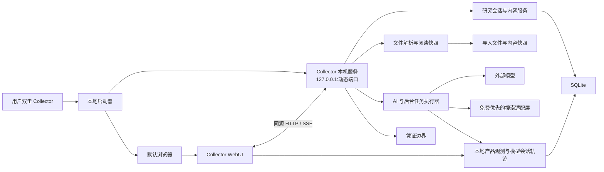

# Collector 技术架构

状态：2026-07-17 本地 WebUI 目标架构。当前代码按本架构逐步实施和验证。

## 架构目标

Collector 是单用户、本机运行的 Web 应用。用户通过普通启动器打开 Collector，全部产品界面运行在默认浏览器中；本机服务负责数据、文件、解析、AI、联网搜索和后台任务。

架构优先保障：

- 普通用户双击即可启动；
- Chat、阅读、选区和研究分支在同一 WebUI 中连续使用；
- 页面刷新、浏览器关闭和服务异常后的状态可恢复；
- 私人文件和研究数据保存在本机；
- 产品事件、模型会话和搜索链路在本机形成完整观测轨迹；
- 外部模型与搜索只接收当前操作所需内容；
- 单个开发者可以构建、测试、打包和维护。

## 运行结构



WebUI 与 API 优先由同一地址提供。页面资源、数据请求和流式回答共享一个受控来源，减少端口、CORS 和部署复杂度。

## 组件职责

### 本地启动器

- 启动或复用 Collector 本机服务；
- 选择可用端口并记录当前实例；
- 确认服务身份和健康状态；
- 在默认浏览器打开当前工作区；
- 重复启动时复用现有实例；
- 协助异常退出后的恢复和日志定位。

启动器只承担运行生命周期，不承载产品界面。

### WebUI

- 最近研究会话、Chat、当前内容和设置；
- 浏览器文件选择与拖放上传；
- AI 回答和导入文档的统一阅读；
- 选区智能窗口、弱标记和来源高亮；
- 深入研究二选一、研究分支和来源线；
- 稍后再学、弱重现和用户控制；
- 加载、空状态、恢复状态和错误状态；
- 键盘、焦点、响应式布局和减少动态效果。

WebUI 使用 HTTP API 和流式连接，不直接访问 SQLite、文件系统或模型凭证。

### 本机 API 与领域服务

- 研究会话、当前内容、研究分支和稍后再学；
- 文件上传、内容快照、解析状态和来源锚点；
- 模型配置状态、AI 调用和按需搜索；
- 任务创建、幂等、取消、重试和恢复；
- 本地会话认证、来源校验和输入边界；
- 数据导出、清理和关闭本地服务。

### SQLite 与文件存储

SQLite 保存结构化业务数据、任务状态、配置状态、来源关系、产品事件和模型及搜索轨迹。导入原文件与稳定内容快照使用受控文件目录保存。

数据库与文件记录通过稳定 ID 关联。迁移使用事务和备份；清理操作同步处理数据库、文件、凭证状态和 WebUI 状态。

### 模型与后台任务

后台任务保存实际输入与输出、提供商、模型、提示版本、调用参数、流式片段、工具调用、状态、用量、费用、延迟、重试、取消和错误。用户提交与调用轨迹在模型调用前持久化。

Chat 和研究生成通过 SSE、流式 `fetch` 或等价连接渐进交付。流连接中断后，WebUI 根据任务 ID 查询当前状态并继续展示已经保存的输出。

模型输出经过结构、引用和来源校验后进入正式结果。AI 增强状态与选区、来源关系、稍后再学等基础数据分离。

## 本地产品观测与模型会话轨迹

Collector 在 WebUI 事件入口、领域任务、模型网关和搜索适配层生成统一轨迹。一次用户操作使用稳定关联 ID 串联：

- 界面操作、页面状态和用户可见结果；
- 研究会话、当前内容、选区和研究分支；
- 后台任务、步骤、重试与恢复；
- 模型提示、上下文、参数、流式回复、工具调用和最终输出；
- 搜索查询、搜索后端、候选结果、页面读取、引用选择和失败状态；
- 首字延迟、总耗时、token、费用、取消和错误。

轨迹采用接近 OpenTelemetry 与 OpenInference 的层级结构，并保留本地查询与导出接口。当前实现直接写入 Collector SQLite，保持单机安装体验；后续可以增加到 Langfuse、Helicone、Arize Phoenix 或其他兼容系统的可选导出器。

原始模型会话内容保存在本地轨迹存储中。API Key、本地会话令牌和认证头在进入轨迹前清除。普通运行日志保存定位运行故障所需的结构化信息，完整会话内容通过轨迹查看与导出。

## 联网搜索

搜索能力通过独立适配层进入研究任务。默认路径优先满足免费、无需用户单独申请搜索凭证和可返回来源链接；SearXNG 兼容接口是首选工程候选。

搜索适配层支持多个后端、超时、重试、健康检查和故障切换。公开免费实例用于原型验证，正式本地运行方案通过自带服务或可控后端保障核心搜索链路。每次搜索及页面读取都进入本地轨迹，并保留最终引用所依据的来源。

## 本地服务安全

- 服务只监听 `127.0.0.1`；
- WebUI 和 API 使用同源交付；
- 数据路由使用本地会话令牌；
- 校验 `Host`、`Origin` 和请求来源；
- CORS 使用精确允许来源；
- 状态修改请求具备 CSRF 防护或等价同源保护；
- 请求体、文件、响应、重定向、解析工作量和网络时间均有上限；
- 外部 URL 在请求前和重定向后校验公网目标；
- API Key、会话令牌、认证头和系统敏感字段在日志与轨迹入口清除；
- 关闭本地服务使用当前会话授权，并展示明确确认结果。

本地监听表示部署位置，认证与来源校验承担访问控制。

## 模型凭证

模型密钥只进入本机服务的凭证边界。WebUI 提交新密钥后只接收“已配置”、供应商和模型等状态信息。

凭证存储方案需要满足：

- 原始密钥避开 WebUI 状态、浏览器存储、普通业务表、日志和导出；
- 服务重启后可以恢复；
- 配置清理与凭证清理保持一致；
- 存储能力不可用时展示明确恢复路径；
- 自动化测试使用隔离的假凭证存储。

具体系统凭据实现通过独立技术原型确定。

## 文件导入与内容快照

```text
浏览器选择或拖放文件
        ↓
受限上传接口
        ↓
保存原文件与校验信息
        ↓
确定性解析
        ↓
生成阅读视图、结构锚点和稳定内容快照
        ↓
WebUI 阅读、选区、研究与来源返回
```

MVP 文件范围为 TXT、Markdown、DOCX 和文本型 PDF，单文件上限暂定 20 MiB。

来源锚点组合内容 ID、结构位置、文本原句、前后缀和必要的页码或段落信息。精确匹配成功时高亮；其他状态展示保存快照和粗粒度位置。

## 会话与任务恢复

- 用户输入在任务启动前保存；
- 每个长任务具有稳定任务 ID 和幂等请求 ID；
- 页面刷新后重新读取当前会话、阅读位置和任务状态；
- 浏览器页面关闭后，本机服务继续保存任务进度；
- 服务异常退出后，下一次启动恢复可继续任务并标记需要人工处理的状态；
- 重复启动复用当前服务实例；
- 健康响应包含实例 ID，启动器确认连接到正确实例。

## WebUI 布局

WebUI 使用自适应研究画布：中央显示当前内容，左侧内容导航按需展开并可在宽屏固定，右侧提供 AI 伴读和稍后再学。研究分支通过来源线展示来路，宽屏可以临时并排显示来源与研究内容。

完整布局记录在 `docs/INTERFACE_DIRECTIONS.md`，具体交互记录在 `docs/INTERACTION_DESIGN.md`。

## 当前代码实施边界

可直接复用的后端基础包括 Node API、SQLite、共享契约、模型网关、文件解析与部分任务恢复机制。

WebUI、同源资源服务、流式接口、本地启动器、Web 凭证边界和浏览器自动化测试属于当前实施工作。

`apps/desktop-capture` 与 `apps/browser-extension` 作为迁移期间的代码基线，由明确的迁移或清理任务处理。新的产品界面行为进入 WebUI 与 HTTP/SSE 路径。

## 技术原型与验证

进入完整实施前验证：

- WebUI 与 API 同源构建和动态端口启动；
- 双击启动、重复启动、默认浏览器打开和服务关闭；
- 本地会话、Host/Origin 校验和其他网页访问隔离；
- Chat 流式输出、刷新恢复和后台任务继续；
- DOCX/PDF 阅读、选区、稳定锚点和重启后返回；
- 模型凭证存储、读取、清理和不可用状态；
- 选区窗口定位、键盘操作和响应式底部抽屉；
- 稍后再学弱重现和来源返回。

## 当前技术选型

- WebUI 位于 `apps/web`，使用 React、TypeScript、Vite 和 React Router；
- 浏览器端到端测试使用 Playwright，并为端口、数据目录、会话和模型供应商提供隔离配置；
- WebUI 构建产物由 `apps/api` 同源提供；
- 普通业务请求使用 HTTP，生成内容与后台任务通过统一客户端封装接收 SSE、流式 `fetch` 或等价的渐进事件；
- 搜索能力进入独立适配层，SearXNG 兼容接口作为首个实现；
- 产品事件、领域任务、模型调用和搜索调用共享关联 ID，并保存在本地轨迹存储中。

## 实施研究项

以下工程验证随对应纵向切片完成：

- 本地启动器的打包形式；
- Windows 系统凭据或独立安全存储实现；
- 本地轨迹表结构、OpenTelemetry/OpenInference 映射和可选导出器；
- SearXNG 的本地运行方式、免费搜索后端组合和故障切换策略；
- DOCX 阅读渲染库和结构提取组合；
- PDF 阅读、文本层和页内锚点方案。
