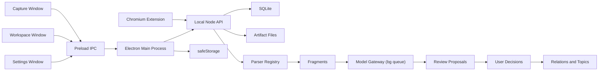

# Collector 当前技术架构与决策

日期：2026-06-12
适用范围：可信知识整理闭环里程碑

## 决策摘要

| 决策 | 结论 | 理由 |
| --- | --- | --- |
| 应用形态 | TypeScript 模块化单体 | 已有双入口和 API 可共享类型，当前规模不需要多服务 |
| 桌面端 | Electron | 避免新增 WPF/C#，复用 TypeScript 与 API Client |
| 存储 | Node `node:sqlite` | 单用户本地部署、事务与迁移需求适配，运维成本低 |
| 文件存储 | 本地 Artifact 目录 | 原文件不可变保存，当前无需对象存储服务 |
| 后台处理 | 进程内显式工作流，后续再持久队列 | 当前数据量不值得引入 Redis；状态必须先进入数据库 |
| 模型 | 可替换网关，首个 Provider 为 DeepSeek | Fake Provider 支持离线回归，业务层不绑定供应商 |
| 工作台 | Electron 独立常规窗口 | 原生 IPC 通信、本地优先；不再承载 Web 页面或 HttpOnly 会话 |
| 检索 | 先全文与确定性候选，向量后置 | 当前核心风险是证据和审核，不是大规模召回 |

旧文档中的 FastAPI、PostgreSQL/pgvector、Redis、Docker Compose 和独立 Next.js 是早期通用 SaaS 假设。后续需求已经明确单用户、本地部署和 SQLite，因此代码偏离旧技术栈属于正确收敛，不应回退。

## 运行结构



三个 Renderer 均保持 contextIsolation: true, nodeIntegration: false, sandbox: true。解析、模型调用、关系判断和正式知识写入都属于 API/领域层，通过 Preload IPC bridge 接入 Main Process，再由 Main Process 调用本地 API Client。

### 窗口职责

| 窗口 | 触发 | 职责 |
| --- | --- | --- |
| 极简采集窗 | Ctrl+Shift+Space | 唯一文本输入区、附件拖放、Esc 保留草稿、Ctrl+Enter 提交 |
| 知识工作台 | 托盘/采集窗按钮 | 收件箱、主题、审核、关系、模型运行和证据对比 |
| 设置 | 托盘/工作台按钮 | DeepSeek Key 与授权、快捷键、后续功能占位标记 |

设置页中尚未完成的功能（模型预算策略、导入导出、同步、学习计划）以禁用的占位卡片呈现，并标注"后续提供"或"后续阶段"。不做伪装成可用的空页面。

Web 工作台（inbox-page.ts）已删除。用户界面完全由 Electron 原生窗口承载，不再依赖外部浏览器或 Web 服务。

## SQLite 策略

当前 Capture 等表保留 `record_json` 作为完整兼容载荷，同时把幂等、外键、排序和查询所需字段设为正式列。这是 JSON Store 迁移阶段的过渡策略。

以下实体必须使用一等表和约束，不能只塞入 JSON：

- `relations`：状态、版本、来源建议和撤销时间；
- `user_decisions`：目标、动作、前后状态和时间；
- `topics` 与 `topic_memberships`；
- `agent_runs`：供应商、模型、提示词、成本、状态和错误；
- `settings`：非敏感配置和授权状态。

迁移执行以 `schema_migrations`/专用迁移标记为准，不能根据 Capture 数量推断。旧 JSON 只有在事务提交后才备份，失败时保持原样。

## API 安全

- API 只监听回环地址，但回环不是鉴权。
- `/health`、静态工作台壳和 `/v1/pairings/exchange` 可匿名；数据路由必须鉴权。
- 桌面端持有主 Token，扩展通过六位一次性配对码换取独立 Token。
- 配对码不得放入 HTTP 查询串；工作台使用 URL fragment 传递并立即清除。
- Token hash 存 SQLite；Key 使用 `safeStorage`，不得复用 Token 存储路径。
- 配对交换需要失败速率限制，防止本机恶意页面枚举六位码。
- CORS 只允许本地工作台与 Chromium 扩展 origin，且授权仍是必要条件。

## 处理工作流

```text
capture persisted
-> local parser
-> fragments persisted
-> preflight route
-> optional model run
-> validated knowledge items and proposals
-> user decision
-> formal relation/topic membership
```

原始持久化成功是后续步骤的前置条件。解析或模型失败不得删除 Capture；应更新处理状态并写入错误运行记录。

## 已知合理折中

- 模型调用已从采集请求中解耦：先持久化 `queued AgentRun`，再由进程内串行执行器处理，并在启动时恢复 `queued/running` 任务。若未来需要并发、取消、优先级或跨进程执行，再升级为独立持久队列。
- `innerText` 整页快照是首版可接受输入，不等同于成熟 Readability 正文解析。
- SQLite 不提供 pgvector；在可靠关系审核形成前，词法候选和小规模内存向量足够。
- 本地 Web 工作台先使用轻量页面；复杂 UI 可以后续交给独立前端实现，但不能复制领域逻辑。

## 已纠正的实现偏离

1. 迁移状态已改为显式 `legacy_migrations` 标记，不再通过 Capture 数量判断。
2. 工作台配对码已改为 URL fragment，并在交换前从地址栏清除。
3. 配对交换已增加失败速率限制。
4. Relation 接受和撤销均通过存储事务追加审计记录。
5. 桌面端提交 `topicId` 时，Capture 与主题成员关系在同一事务中落库。
6. TypeScript `.tsbuildinfo` 已加入忽略规则。

## 当前未关闭风险

1. GUI smoke 已验证 Renderer、Preload、IPC、文本提交、文件上传和 SQLite 持久化。当前受管 Codex 环境会使 Chromium process sandbox 崩溃，因此测试进程使用 `--no-sandbox`；生产启动不包含该参数，并显式启用 `sandbox`、`contextIsolation` 及 CSP。仍需在用户正常桌面会话中保留一次沙箱开启的人工 smoke。
2. PDF 文本抽取可用，但当前机器的可选 `@napi-rs/canvas` 原生绑定损坏，会产生 PDF.js 渲染警告；扫描 PDF 本阶段不支持。
3. 真实 DeepSeek 调用仍需用户提供已轮换 Key 并明确授权。Fake Provider 已覆盖成功、非法 JSON、无效引用和供应商错误路径。
4. 标准模型抽取显式关闭思考模式；deepseek-v4-pro 仅由工作台的 L3 深度分析按钮人工触发。两类运行均记录 token、延迟和估算成本。
5. 剩余 Web 页面依赖已废弃；/ 根路径返回 { name: "Collector Local API", ui: "electron" } 供客户端检测用。

## 架构升级触发条件

只有出现以下证据时才评估 PostgreSQL、独立队列或服务拆分：

- 多用户或远程同步成为明确需求；
- 单进程任务造成可测量的 UI/API 可用性问题；
- SQLite 写锁成为真实瓶颈；
- 数据规模使本地检索无法满足目标延迟；
- 需要多设备共享、远程任务或服务端定时处理。

在触发条件出现前，引入 Redis、PostgreSQL、微服务或多 Agent 编排只会增加部署和故障面。
