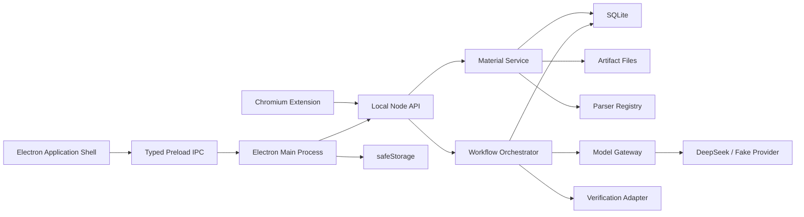

# Collector 技术架构

日期：2026-06-13
适用范围：PRD 2.0 目标架构

## 1. 架构目标

Collector 是单用户、本地优先的 Windows 桌面应用。架构优先保证：

- 采集永远先于 AI 处理完成；
- 原始材料和来源定位长期可追溯；
- 桌面交互呈现为一个完整应用；
- AI 工作流可恢复、可重试、可取消、可审计；
- 模型供应商、提示词和编排框架可以替换；
- 复杂基础设施只有在出现真实瓶颈后引入。

## 2. 决策摘要

| 决策 | 结论 | 理由 |
| --- | --- | --- |
| 应用形态 | TypeScript 模块化单体 | 单用户本地应用无需微服务 |
| 桌面 UI | Electron 单应用壳、单主窗口 | 避免采集、工作台和设置割裂 |
| 存储 | Node `node:sqlite` | 支持本地事务、迁移和可恢复任务 |
| 文件存储 | 本地 Artifact 目录 | 原文件不可变保存，无需对象存储服务 |
| 后台执行 | SQLite 持久化工作流 + 进程内执行器 | 满足本地恢复需求，避免 Redis |
| AI 编排 | 显式领域工作流，暂不引入 LangGraph | 当前流程以确定性步骤和人工边界为主 |
| 模型接入 | 可替换 Model Provider，首个 Provider 为 DeepSeek | 业务层不绑定供应商，Fake Provider 支持离线测试 |
| 检索 | 全文、确定性候选和轻量向量逐步组合 | 数据规模尚不需要外部向量数据库 |

## 3. 运行结构



Renderer 保持 `contextIsolation: true`、`nodeIntegration: false` 和 `sandbox: true`。解析、持久化、AI 编排、核验和文档版本写入属于领域/API 层，不进入 Renderer。

## 4. 单窗口应用壳

### 4.1 视图结构

Collector 只维护一个主要 `BrowserWindow`，内部切换：

- 快速采集；
- 近期收集；
- 专题；
- 全部材料；
- 设置。

设置是应用内页面，不创建独立窗口。工作台也是默认主界面，不创建第二个窗口。

### 4.2 快速采集模式

全局快捷键不会创建新的采集窗口，而是唤起主窗口并进入紧凑采集模式：

- 保存进入前的路由和界面状态；
- 调整窗口尺寸、置顶状态和输入焦点；
- 提交或取消后恢复原页面和常规窗口状态；
- 主窗口已经可见时，优先使用窗口内采集层，避免界面跳跃；
- 草稿由 Renderer 本地状态或本地草稿存储保存，持久化成功后才清空。

托盘菜单只负责唤起并导航到指定视图。单实例锁、测试实例 ID、端口、数据库和 `userData` 仍需隔离。

## 5. 数据边界

### 5.1 长期领域实体

- `Material`：用户可见的原始材料记录；
- `Artifact`：不可变原文件或网页快照；
- `Fragment`：内部引用片段和定位；
- `RecentCluster`：可重新计算的近期临时分组；
- `Topic`：用户确认的长期专题；
- `TopicMembership`：专题对材料的引用；
- `TopicDocument`：专题主文档；
- `DocumentVersion`：文档版本与用户编辑保护信息；
- `VerificationRecord`：关键结论的核验结果与来源；
- `WorkflowRun`、`WorkflowStep`：AI 工作流状态、成本和错误；
- `ModelCall`：一次实际模型请求及其脱敏观测数据。

`KnowledgeItem`、`RelationSuggestion`、`ReviewProposal` 和正式 Relation 不再属于目标领域模型。迁移期处置见 `IMPLEMENTATION_TRANSITION.md`。

### 5.2 事实与派生数据

- 原始材料和 Artifact 是溯源记录，不是已验证事实；
- Fragment 是引用基础，不作为用户管理对象；
- 近期分组、摘要、文档和核验状态都是可追踪来源的派生数据；
- 用户编辑和用户确认具有独立审计记录；
- 派生数据可以重算，但不得覆盖原始材料或用户编辑。

## 6. AI 工作流架构

### 6.1 为什么需要工作流层

新版产品不再是“每条材料调用一次模型”。以下任务由多个步骤组成，并存在暂停、失败恢复、人工确认和成本边界：

1. 近期材料批量分组；
2. 专题文档生成；
3. 关键结论集中核验；
4. 新材料影响分析与文档增量更新。

因此需要独立于 Model Gateway 的工作流层。Model Gateway 只负责一次模型调用；Workflow Orchestrator 负责业务步骤、状态推进和持久化。

### 6.2 工作流状态模型

```text
queued
→ running(step N)
→ waiting_for_user / waiting_for_budget / retry_scheduled
→ succeeded / failed / cancelled
```

每一步开始前写入状态，完成后以事务保存输出和下一状态。进程异常退出后，从最后一个已完成步骤恢复，而不是重复整条流程。

必须具备：

- 幂等工作流键，避免重复批处理和重复文档版本；
- step 级输入 checksum 与输出版本；
- 有限次数重试和指数退避；
- 取消与超时；
- token、费用和预算检查；
- 用户确认边界；
- 日志与错误脱敏；
- 启动时恢复未完成任务；
- 同一专题的互斥更新，避免并发生成冲突版本。

### 6.3 四类领域工作流

#### RecentOrganizationWorkflow

```text
选择未整理材料
→ 本地去重与候选召回
→ 分批生成候选分组
→ 合并和稳定性校验
→ 保存 RecentCluster 快照
```

分组失败不影响原始材料。旧快照可继续展示，并标记更新时间。

#### TopicDocumentWorkflow

```text
冻结本次材料集合
→ 解析和引用完整性检查
→ 生成文档提纲
→ 分章节整理
→ 汇总关键结论
→ 进入核验工作流
→ 校验并创建文档版本
```

长材料按引用片段分批处理，最终文档必须保存材料集合版本和引用映射。用户点击“生成专题文档”即构成本次生成授权，不再追加一次发布审批。

#### VerificationWorkflow

```text
识别需要核验的关键结论
→ 依据授权决定是否联网
→ 检索可信来源
→ 对比支持、争议、时效性
→ 保存 VerificationRecord
→ 返回文档生成流程
```

核验失败不阻止生成，只改变结论的呈现状态。外部搜索结果默认是核验依据，不自动成为用户材料。

#### TopicUpdateWorkflow

```text
比较新旧材料集合
→ 识别受影响章节和引用
→ 保护用户编辑段落
→ 生成增量补丁与预览
→ 用户确认
→ 创建新 DocumentVersion
```

全文重写必须是显式的不同操作。

### 6.4 执行器

首版使用模块化单体内的进程内执行器：

- SQLite 保存 `WorkflowRun` 和 `WorkflowStep`；
- 已实现的首个 `recent_organization` 切片使用 `queued -> processing -> completed | failed` 状态机；API 触发只负责持久化排队记录，执行与请求生命周期解耦；
- 成功发布时，完成状态、步骤和 `RecentClusterSnapshot` 在同一事务提交；最新快照由数据库发布序号确定，不依赖毫秒时间戳或随机 ID；
- 执行器按任务类型设置有限并发；
- 通过租约或原子状态转换领取任务，避免重启或多实例重复执行；
- 工作流定义是显式 TypeScript step 列表和状态转换；
- step handler 通过接口调用 Parser、Retriever、Model Gateway、Verification Adapter 和 Store；
- 测试使用 Fake Provider 和 Fake Search Adapter，逐步断言恢复、重试和人工暂停。

进程内执行不表示状态只保存在 Promise chain 中。Promise 只负责当前执行，SQLite 才是任务状态的事实来源。

## 7. LangGraph 决策

### 7.1 当前不纳入基础架构

LangGraph 提供持久化执行、checkpoint、human-in-the-loop 和图式编排，能力上可以覆盖 Collector 的部分需求。但当前不把它作为首版依赖，原因是：

- 当前四类工作流主要是可枚举的确定性步骤，不需要 Agent 自主规划循环；
- 用户确认通常位于明确阶段边界，可由持久化状态机表达；
- Collector 已以 SQLite 作为领域数据和任务状态的事实来源，引入独立 checkpoint 模型会增加双重状态协调；
- 本地 Electron 打包需要控制依赖规模、运行故障面和升级成本；
- 自有 step 接口更容易围绕引用完整性、用户编辑保护和成本预算编写确定性测试。

因此首版采用“领域工作流接口 + 自有 SQLite 执行器”，同时避免把业务逻辑写死在执行器中，以保留未来迁移能力。

能力判断参考 LangGraph 官方的 [Persistence](https://docs.langchain.com/oss/javascript/langgraph/persistence) 与 [Interrupts](https://docs.langchain.com/oss/javascript/langgraph/interrupts) 文档。框架提供这些能力不代表 Collector 当前必须采用该框架。

### 7.2 重新评估触发条件

出现以下任一真实需求时，重新评估 LangGraph 或同类框架：

- 模型需要动态选择工具并形成不可预先枚举的循环；
- 一个工作流存在大量条件分支、子图和多个人工中断点；
- 自有 checkpoint、恢复和并行分支代码成为主要维护负担；
- 引入远程执行、多设备任务或独立 worker；
- 需要框架级的执行轨迹、时间旅行调试或跨 Agent 协作。

评估时应先做一个与 `TopicDocumentWorkflow` 等价的替换原型，比较恢复语义、SQLite 集成、打包体积、测试复杂度和迁移成本，不能只因流程图变复杂就直接引入。

## 8. 模型网关

Model Gateway 保持供应商无关，只承担一次受约束调用：

- 选择 provider、model、thinking 和 token 上限；
- 构造结构化请求；
- 超时、有限重试和错误脱敏；
- Schema 与引用 ID 校验；
- 记录 token、费用、延迟和提示词版本。

不同工作流使用独立的输入输出 Schema，废止“一套 KnowledgeExtraction 覆盖所有任务”的做法。例如分组、提纲、章节整理、关键结论和核验判断应分别定义契约。

DeepSeek 是首个 Provider，不是领域层依赖。真实云调用和离线 Fake Provider 验收必须分开。

## 9. 本地 API 与安全

- API 只监听回环地址，但所有数据路由仍需鉴权；
- 仅 `/health` 和一次性配对交换匿名；
- 扩展通过五分钟有效、仅可使用一次的配对码获得独立 Token；
- CORS 只允许明确的应用和扩展来源；
- Token hash 存 SQLite，DeepSeek Key 使用 `safeStorage`；
- Key 不得进入 Renderer、SQLite、日志、导出、源码或 `.env`；
- URL 抓取限制超时、响应大小和重定向，并阻止私有地址和本机地址；
- 首次云处理需要授权，单条材料可禁用云端处理。

## 10. SQLite 与迁移

- 使用 WAL 和 foreign key；
- Schema 变化由显式 migration 管理，不根据数据数量推断；
- 迁移在事务中执行，失败时保持旧数据可用；
- 大文件保存在 Artifact 目录，数据库保存 checksum、路径和元数据；
- 文档版本、专题成员变化、用户确认和工作流状态使用正式表与约束；
- 用户删除默认进入回收站，永久删除采用引用影响检查和事务处理。

### 10.1 备份与导出

- 完整备份使用一致性 SQLite 快照、Artifact 文件和版本化 manifest，必须可以在兼容版本中恢复；
- 便携导出面向用户阅读和迁移，至少包含原始材料元数据、专题文档 Markdown、引用映射和用户附件；
- `safeStorage` 中的模型 Key、本地主 Token、扩展 Token 和其他认证材料不得进入备份或导出；
- 备份和导出写入临时目标，校验完成后再原子发布，失败不得留下被界面误认为有效的归档；
- 设置页面显示实际数据目录、最近备份时间、归档格式版本和失败原因。

## 11. 验证策略

每个垂直切片需要验证：

1. 输入是否先持久化；
2. 解析和来源定位是否稳定；
3. 工作流失败是否可恢复且不污染有效版本；
4. 模型输出是否通过本地 Schema 与引用校验；
5. 用户确认前是否没有正式变更；
6. UI 是否显示真实持久化结果，而非仅显示成功提示；
7. token、费用和错误是否完整且脱敏；
8. GUI smoke 是否使用隔离端口、数据库、实例 ID 和 `userData`。

最低检查包括：

```powershell
npm.cmd test
npm.cmd run test:gui
powershell -ExecutionPolicy Bypass -File .agents\skills\collector-engineering\scripts\check-project.ps1
```

真实 DeepSeek 与真实联网核验属于显式人工验收，不应成为离线 CI 的前置条件。

## 12. 升级触发条件

仅在出现可测量证据时升级基础设施：

- SQLite 写锁成为实际瓶颈；
- 单进程执行影响 UI 或 API 可用性；
- 需要远程 worker、多设备同步或多用户；
- 本地检索无法满足目标数据规模和延迟；
- 自有工作流编排达到第 7.2 节的重新评估条件。

在这些条件出现前，不引入 PostgreSQL、Redis、微服务或多 Agent 编排。
