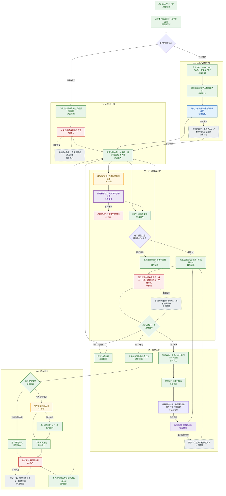

# Collector 功能链路与 AI 依赖

状态：2026-07-17 共识基线。本文记录当前 MVP 的用户主链路、依赖等级与恢复路径。

## 图例

- `基础能力`：模型状态独立于该能力，始终可用；
- `AI 增强`：AI 提高效率或质量，基础路径持续可用；
- `AI 核心`：AI 负责交付该结果，界面保存现场并提供恢复操作；
- `文件解析`：确定性文件解析与渲染负责交付；
- `稳定锚点`：内容快照、段落、页码或文本位置负责来源返回。

## 当前主功能链路



## 动态意图来源

AI 每次分析选区时，按当前可用信息组合判断：

1. 最近的用户明确表达；
2. 当前研究会话的必要上下文；
3. 当前正在阅读的内容；
4. 选区附近段落；
5. 用户已经明确执行的深入研究、稍后再学和优先级操作。

界面根据实际使用范围说明本次判断依据。

## 本地观测链路

Collector 为每次用户操作生成稳定关联 ID，并在本机串联保存：

```text
界面操作
→ 研究会话、当前内容与选区
→ 后台任务和处理步骤
→ 模型请求、流式回复与工具调用
→ 搜索查询、页面读取与引用选择
→ 用户可见结果、耗时、用量和错误
```

观测数据保留实际模型会话内容和搜索链路，排除供应商凭证、认证头和本地会话令牌。记录可以按会话、任务、错误和时间查看及导出，并在数据清理时与对应业务数据一起清理。

## 用户可见交付条件

- 双击启动后在默认浏览器打开本地 WebUI；
- WebUI 刷新后恢复已保存会话、阅读位置和任务状态；
- Chat 和导入文档作为并列入口；
- AI 回答、导入文档和研究分支使用同一套阅读与选区交互；
- 选区窗口立即显示固定结构、加载状态和主要操作；
- 稍后再学由用户设置优先级，并提供可解释的弱重现；
- 深入研究保存与来源内容和选区的双向关系；
- AI 弱标记聚焦短概念，以低注意力密度从上到下显示；
- 来源返回只在锚点可靠时高亮，并始终提供保存快照；
- AI 核心能力保存现场并提供重试或切换模型。
- 产品事件、模型会话与联网搜索形成可查看和导出的本地关联轨迹。
