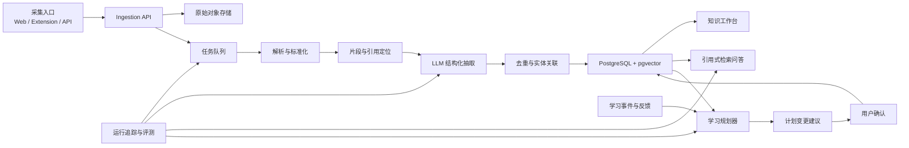

# 分散知识采集与动态学习规划 Agent：Program Plan

版本：0.1  
日期：2026-06-11  
状态：架构基线，可用于拆解实施任务

竞品能力与差异化分析见 [COMPETITOR_ANALYSIS.md](./COMPETITOR_ANALYSIS.md)。实施优先级以该文档第 5 节的修正为准：先验证证据化采集、关系审核与成本门控，再扩展来源、问答和学习计划。

## 1. 项目定义

### 1.1 问题

学习过程中，知识会沿着“视频 -> AI 问答 -> 引用网页 -> 新概念 -> 其他平台”的路径不断扩散。传统笔记工具通常只保存最终文字，无法稳定保留：

- 内容来自哪里，以及原始上下文是什么；
- 一个结论由哪些来源支持，哪些只是 AI 推断；
- 新内容与已有知识的关系；
- 哪些知识已理解、待验证或需要复习；
- 当前学习计划是否仍符合目标、时间和掌握程度。

### 1.2 产品目标

构建一个个人知识学习系统，使用户可以低摩擦地采集分散内容，自动整理为可追溯的知识单元，并根据目标和真实学习反馈持续调整计划。

核心闭环：

```text
采集 -> 解析 -> 提取 -> 关联 -> 人工确认 -> 学习 -> 检验 -> 调整计划
```

### 1.3 非目标

首版不追求：

- 无限制自动浏览整个互联网；
- 用知识图谱替代所有原始资料；
- 完全自主、不可解释地修改用户计划；
- 同时支持所有视频、社交媒体和付费平台；
- 让多个 Agent 自由对话来“涌现”结果；
- 成为通用团队协作或企业文档平台。

## 2. 产品原则

1. **来源优先**：任何摘要、结论和知识卡片都必须能回到来源片段。
2. **事实与推断分离**：原文、模型抽取、模型推断、用户观点使用不同字段和 UI 标识。
3. **增量整理**：新内容进入已有主题，而不是每次生成一份孤立长文。
4. **人在回路中**：删除、合并、外部深度检索和大幅改计划需要确认。
5. **确定性骨架，LLM 辅助**：状态、权限、调度和数据一致性由程序控制；LLM 负责语义任务。
6. **单体优先**：先建立一个可观测、可测试的模块化单体，达到规模后再拆服务。
7. **模型可替换**：业务代码不绑定单一模型供应商，按任务选择模型档位。
8. **先有评测再提高自主性**：没有离线样本和质量指标，就不扩大 Agent 权限。

## 3. 目标用户流程

### 3.1 快速采集

用户提交 URL、文本、AI 对话、PDF、Markdown 或视频字幕，选择一个已有主题或留给系统推荐。系统立即保存原始内容，后台完成解析和整理。

结果包括：

- 来源元数据和原始快照；
- 可引用的内容片段；
- 摘要、关键概念、问题、结论和待验证项；
- 与已有主题/概念的候选关联；
- 一组等待用户确认的变更建议。

### 3.2 深入探索

用户从某个概念发问。系统优先使用个人资料库作答，并逐句附带引用。如果证据不足，系统明确指出缺口，再由用户授权外部检索。

外部检索结果不会直接成为“已知事实”，而是先作为新来源进入采集流程。

### 3.3 自动整理

系统把多个来源的重复信息合并为主题摘要，但保留不同观点、时间版本和冲突。用户可以接受、修改或拒绝建议，反馈用于后续排序和提示词优化。

### 3.4 动态学习计划

用户输入目标、截止时间、每周可用时间、当前水平和偏好。系统生成带先修关系、预计耗时、学习材料和验收方式的计划。

完成任务、测验结果、延期、新增知识或时间变化会触发局部重排。系统必须展示“为什么改、改了什么、影响什么”，重大调整需确认。

## 4. 功能范围

### 4.1 MVP 必须具备

- 文本、网页 URL、Markdown、PDF、AI 对话的采集；
- 视频以用户提供字幕或平台允许获取的字幕为入口；
- 原始内容快照、分段和精确引用；
- 摘要、概念、问题、行动项、观点和事实主张抽取；
- 主题归档、标签、全文搜索和向量搜索；
- 基于个人资料的引用式问答；
- 重复来源与近似知识候选检测；
- 用户确认队列；
- 基础学习目标、任务计划、完成记录和局部重排；
- Agent 运行记录、模型成本、失败重试和取消；
- 数据导出为 Markdown/JSON。

### 4.2 第二阶段

- 浏览器扩展和移动端分享入口；
- YouTube 等合规字幕连接器；
- 间隔复习、测验生成和掌握度估计；
- 冲突观点检测和时间版本管理；
- 用户授权后的外部研究工作流；
- Obsidian/Notion 等单向或双向同步；
- 周报、学习回顾和计划偏差分析。

### 4.3 暂缓

- 自动登录和抓取受限平台；
- 多用户实时协作；
- 全自动知识本体构建；
- 微服务化和独立图数据库；
- 无审核的自动发布或自动执行外部操作。

## 5. 系统架构



### 5.1 推荐技术栈

| 层 | 首选 | 说明 |
|---|---|---|
| Web | Next.js + TypeScript | 工作台、采集页、审核队列、计划视图 |
| API | FastAPI + Python | 文档处理和 LLM 生态更成熟 |
| 后台任务 | Celery/Dramatiq + Redis | MVP 足够；任务必须幂等 |
| 主数据库 | PostgreSQL | 结构化数据、全文检索和事务 |
| 向量检索 | pgvector | 首版减少独立基础设施 |
| 对象存储 | 本地兼容层，生产使用 S3 兼容存储 | 原文件、快照和解析产物 |
| Agent 编排 | 普通 Python 状态机起步，复杂后引入 LangGraph | 避免首版框架复杂度 |
| 观测 | OpenTelemetry + 结构化日志 | 统一记录 trace、模型调用和成本 |
| 部署 | Docker Compose 起步 | 单机可运行，后续再迁移托管服务 |

选择 pgvector 是因为它能把向量和业务数据放在同一 PostgreSQL 中，并支持精确/近似近邻与 HNSW；首版通常不需要单独的向量数据库。数据量或检索形态证明有需要时，再评估 Qdrant 等专用系统。

LangGraph适合长运行、有状态、需持久化和人工中断的工作流，但不应成为业务领域模型。首版可先用显式状态和任务表实现，研究工作流变复杂后再引入。

### 5.2 模块边界

```text
apps/
  web/                    # 前端
  api/                    # HTTP API 与鉴权
workers/
  ingestion/              # 下载、解析、标准化
  enrichment/             # 摘要、抽取、链接、去重
  planning/               # 计划生成与重排
packages/
  domain/                 # 领域实体、规则、状态机
  connectors/             # 来源连接器接口与实现
  llm_gateway/            # 模型路由、结构化输出、预算
  retrieval/              # 全文、向量、重排、引用组装
  observability/          # trace、成本、审计
  evals/                  # 固定数据集和质量评测
infra/
  migrations/
  docker/
docs/
```

保持一个仓库和一个数据库。模块只能通过领域接口访问其他模块，禁止在 worker 中随意跨表写入。

## 6. 核心数据模型

### 6.1 来源与知识

| 实体 | 关键字段 | 作用 |
|---|---|---|
| `Source` | id, type, canonical_uri, title, author, published_at, captured_at | 外部来源身份 |
| `Artifact` | source_id, object_key, mime_type, checksum, parser_version | 原始快照或文件版本 |
| `Fragment` | artifact_id, ordinal, text, locator, token_count | 最小可引用片段 |
| `Topic` | title, description, status | 用户组织知识的主题 |
| `Concept` | canonical_name, aliases, definition, status | 可复用概念 |
| `Claim` | statement, claim_type, confidence, verification_status | 原文主张或模型推断 |
| `Evidence` | claim_id, fragment_id, support_type, quote_span | 主张与来源片段之间的证据 |
| `Relation` | subject_id, predicate, object_id, confidence | 概念/主张间的候选关系 |
| `Synthesis` | topic_id, content, version, generated_from | 多来源增量总结 |
| `UserDecision` | target_id, action, before, after, reason | 接受、修改、拒绝的审计记录 |

`locator` 按来源类型保存定位信息：网页使用 DOM/文本偏移，PDF 使用页码与坐标，视频字幕使用起止时间，AI 对话使用消息 ID。

### 6.2 学习计划

| 实体 | 关键字段 | 作用 |
|---|---|---|
| `LearningGoal` | outcome, deadline, priority, weekly_minutes | 学习目标和约束 |
| `Competency` | goal_id, concept_id, target_level, current_level | 目标能力 |
| `Plan` | goal_id, version, status, rationale | 可版本化计划 |
| `PlanItem` | concept_id, prerequisite_ids, duration, due_at, acceptance_rule | 可执行学习任务 |
| `LearningEvent` | item_id, type, duration, result, occurred_at | 学习、测验、跳过等事件 |
| `MasteryEstimate` | concept_id, score, uncertainty, evidence | 掌握程度估计 |
| `PlanProposal` | base_version, patch, reason, impact | 待确认的计划变更 |

### 6.3 Agent 运行

`AgentRun` 至少记录：工作流类型、输入版本、当前状态、模型、提示词版本、工具调用、输出、token/金额成本、延迟、错误、重试次数、父运行和人工决策。

## 7. Agent 与工作流设计

不要把系统设计成几个拥有模糊人格的 Agent。每个 Agent 都应是有明确输入、结构化输出、权限和终止条件的工作流。

### 7.1 Intake Workflow

状态：

```text
received -> snapshotted -> parsed -> fragmented -> enriched -> linked -> review_ready -> committed
                                  \-> failed / needs_input
```

职责：

- 规范化 URL，计算 checksum，识别重复采集；
- 保存原始内容后再做任何模型处理；
- 解析正文与元数据，生成稳定片段；
- 以 JSON Schema 抽取摘要、概念、主张、问题；
- 生成候选主题和关联；
- 输出审核建议，不直接覆盖用户内容。

### 7.2 Synthesis Workflow

输入为主题及发生变化的来源集合，仅增量更新受影响的章节。输出必须包含：

- 新增信息；
- 被强化的信息；
- 冲突或过时信息；
- 证据不足的信息；
- 建议更新的主题摘要 patch。

禁止“重新写一篇看似完整但丢失历史的文章”。

### 7.3 Grounded Q&A Workflow

1. 分析问题和限定范围；
2. 混合检索：Postgres 全文 + 向量召回；
3. 按来源质量、时间、用户偏好和语义相关性重排；
4. 生成带 fragment 引用的回答；
5. 对每个关键句进行引用覆盖检查；
6. 证据不足时返回缺口，不填补为事实。

回答状态分为：`supported`、`partially_supported`、`unsupported`、`conflicting`。

### 7.4 Research Expansion Workflow

只有用户授权后才能外部检索，并设置：最大查询数、最大页面数、最大费用、允许域名、截止时间。发现新页面后调用 Intake Workflow，不允许绕过来源保存和审核。

### 7.5 Planning Workflow

规划器不是单次生成日程，而是“约束求解 + LLM 建议”：

- 程序处理截止时间、时间容量、先修依赖和任务冲突；
- LLM 负责把目标拆成能力、推荐顺序、生成学习活动与验收方式；
- 调度器根据约束放置任务；
- 规则验证器检查超额安排、循环依赖和不可测任务；
- 用户确认后产生新的 `Plan.version`。

### 7.6 Review Workflow

按风险排序审核：

1. 来源冲突和无证据结论；
2. 概念合并/删除；
3. 大范围计划修改；
4. 新标签、关系和摘要润色。

低风险建议可以批量接受，高风险建议必须逐项展示证据与影响。

## 8. 动态计划算法

### 8.1 输入

- 目标与截止时间；
- 每周可用时间和不可用时间；
- 能力图及先修关系；
- 用户偏好的学习方式；
- 每个任务预计耗时和重要性；
- 学习事件、测验成绩和掌握度不确定性；
- 用户明确锁定、不允许移动的任务。

### 8.2 优先级建议

对待排任务计算可解释分数：

```text
priority = goal_weight
         * prerequisite_impact
         * knowledge_gap
         * deadline_urgency
         * expected_learning_gain
         / estimated_effort
```

分数用于推荐，不作为不可修改的真理。各因子和最终理由都要写入计划提案。

### 8.3 触发重排

- 用户修改目标、截止时间或每周容量；
- 某任务延期超过阈值；
- 测验结果显著改变掌握度；
- 新发现关键先修知识；
- 连续多次低完成率；
- 用户手动要求重排。

### 8.4 稳定性规则

- 默认只调整未来未锁定任务；
- 不因一次低分重排整个计划；
- 设置最小变更窗口和每日重排上限；
- 重大变更定义为日期跨度、任务删除或总工时变化超过阈值；
- 每次提案显示 before/after、理由和被影响任务；
- 用户可撤回到任一历史版本。

## 9. API 基线

```text
POST   /v1/captures                 创建采集任务
GET    /v1/captures/{id}            获取处理状态
GET    /v1/sources/{id}             来源与片段
POST   /v1/topics                   创建主题
GET    /v1/topics/{id}/workspace    聚合主题视图
POST   /v1/reviews/{id}/decision    接受/修改/拒绝建议
POST   /v1/query                     引用式问答
POST   /v1/research-runs             授权外部研究
POST   /v1/goals                     创建学习目标
POST   /v1/goals/{id}/plans          生成计划提案
POST   /v1/plans/{id}/events         记录学习事件
POST   /v1/plans/{id}/replan         生成局部重排提案
POST   /v1/plan-proposals/{id}/apply 应用计划变更
GET    /v1/agent-runs/{id}           运行详情与成本
GET    /v1/export                    导出用户数据
```

所有异步创建接口返回 `job_id`；所有修改接口使用幂等键；计划和摘要更新使用乐观锁版本号。

## 10. 模型网关与成本控制

### 10.1 任务分层

| 档位 | 任务 | 策略 |
|---|---|---|
| 无模型 | 下载、解析、checksum、规则校验、调度 | 优先确定性代码 |
| 小模型 | 分类、标签、简单抽取、查询改写 | 批处理、缓存、低温度 |
| 中模型 | 多来源综合、引用问答、计划拆解 | 强制结构化输出 |
| 强模型 | 冲突分析、疑难规划、评测失败回退 | 只在路由条件满足时调用 |

### 10.2 网关职责

- 统一 provider/model 接口；
- JSON Schema 校验和自动修复重试；
- 按任务设置 token、费用、延迟预算；
- prompt、schema、model 版本化；
- 相同输入缓存；
- PII/secret 基础检测；
- 熔断、限流、超时和 fallback；
- 记录每个知识产物由哪个运行生成。

### 10.3 上下文策略

不要把整个知识库塞入上下文。使用：查询理解 -> metadata filter -> 混合召回 -> rerank -> 去重 -> token budget packing。长来源先做可追溯层级摘要，但最终引用仍指向原始 fragment。

## 11. 安全、隐私与合规

- 默认单用户、私有数据；
- 原文件和数据库均支持备份与删除；
- 第三方模型调用前明确数据发送范围；
- API key 只存 secret manager/环境变量，不入数据库日志；
- 网页内容视为不可信输入，防御 prompt injection；
- 连接器遵守平台条款、robots、登录和版权限制；
- 外部内容中的指令永远不能提升工具权限；
- 导入、导出、删除和外部研究保留审计记录；
- 提供“仅本地模型/不发送原文”模式作为后续能力。

## 12. 可观测性与评测

### 12.1 运行指标

- 采集成功率、解析失败率、处理 P50/P95；
- 每种来源平均成本；
- schema 校验失败和重试率；
- 引用覆盖率、无效引用率；
- 建议接受/修改/拒绝率；
- 重复检测准确率；
- 计划完成率、延期率和重排后改善；
- 用户从采集到可用知识的时间。

### 12.2 离线评测集

在第一阶段就建立 30-50 个小型黄金样本，覆盖网页、PDF、AI 对话、字幕、重复来源、冲突来源和无足够证据场景。

核心评测：

- fragment 定位能否回到原文；
- 概念/主张抽取 precision、recall；
- 重复与错误合并率；
- 回答关键句的证据覆盖率；
- 引用是否真的支持对应句子；
- 计划是否满足容量、截止时间和先修约束；
- 相同输入在 prompt/model 升级前后的回归。

上线门槛建议：引用定位正确率 100%，关键结论引用覆盖率 >= 95%，计划硬约束违规为 0。语义质量先通过人工评分建立基线，再决定阈值。

## 13. 分阶段实施路线图

### Phase 0：产品与工程基线（1 周）

交付：

- ADR：技术栈、来源模型、引用模型、模型网关；
- 仓库结构、lint、类型检查、测试和 CI；
- Docker Compose：API、Postgres/pgvector、Redis、对象存储；
- OpenAPI 基线和数据库迁移；
- 10 个最初黄金样本。

退出标准：新开发者可用一条命令启动，CI 可运行，核心实体已迁移。

### Phase 1：采集与可追溯整理（2-3 周）

交付：

- 文本、URL、Markdown、PDF 连接器；
- Artifact/Fragment 持久化与稳定 locator；
- 结构化抽取、主题推荐、审核队列；
- 失败重试、幂等、运行状态和费用记录；
- 来源详情与原文引用 UI。

退出标准：一份资料从提交到审核可完整走通，任何生成内容可回到原始片段。

### Phase 2：检索、问答与增量综合（2-3 周）

交付：

- Postgres 全文 + pgvector 混合检索；
- 引用式问答和证据覆盖检查；
- 重复来源、相似概念候选；
- 主题增量摘要及冲突提示；
- Markdown/JSON 导出。

退出标准：黄金集达到引用门槛，新增来源不会无提示覆盖旧观点。

### Phase 3：学习目标与基础计划（2 周）

交付：

- Goal、Competency、Plan、PlanItem；
- 目标拆解、先修图、容量约束和日历视图；
- 学习事件和手动掌握度；
- 计划版本、锁定任务和撤回。

退出标准：计划无硬约束冲突，每个任务有材料、耗时和验收方式。

### Phase 4：动态重排与学习反馈（2-3 周）

交付：

- 测验与复习事件；
- 掌握度估计；
- 局部重排、影响解释和确认；
- 周回顾和计划偏差分析；
- 稳定性规则与回归评测。

退出标准：模拟延期、低分和容量变化时只调整必要任务，并可解释、可撤回。

### Phase 5：入口扩展与受控研究（按价值排序）

交付候选：浏览器扩展、移动分享、字幕连接器、外部研究、Obsidian/Notion 同步。每新增一种来源都必须复用 Artifact/Fragment/locator 契约并补评测样本。

## 14. 可派发给低成本模型的工作包

每个工作包单独建 issue，不允许一次交给模型“实现整个系统”。

| ID | 工作包 | 输入 | 主要产出 | 验收重点 |
|---|---|---|---|---|
| W01 | 工程脚手架 | 本文第 5 节 | monorepo、Compose、CI | 一键启动、健康检查 |
| W02 | 领域模型与迁移 | 第 6 节 | ORM、migration、约束 | FK、唯一性、版本字段 |
| W03 | Connector SDK | Source/Artifact 契约 | 接口、text/markdown 实现 | 幂等、checksum、错误类型 |
| W04 | Web/PDF 解析 | locator 规范 | parser、fixtures | 引用可稳定复现 |
| W05 | LLM Gateway | 第 10 节 | provider、schema、budget | mock 测试、失败回退 |
| W06 | Intake 状态机 | 第 7.1 节 | worker、状态、重试 | 重放不产生重复数据 |
| W07 | 审核工作台 | review API | diff UI、批量操作 | 审计记录完整 |
| W08 | 混合检索 | fragment 数据 | FTS、vector、rank fusion | 固定查询评测 |
| W09 | 引用式问答 | retrieval API | answer schema、citation UI | 每个引用可点击验证 |
| W10 | 增量综合 | topic/source change | synthesis patch | 保留冲突和历史版本 |
| W11 | 计划领域 | 第 6.2/8 节 | goal/plan API、scheduler | 硬约束测试 |
| W12 | 动态重排 | learning events | proposal engine、diff UI | 局部、可解释、可撤回 |
| W13 | Evals/observability | 黄金样本 | eval runner、dashboard | CI 回归可见 |

### 14.1 派单模板

```markdown
目标：只实现 Wxx，不扩展范围。

必读：docs/PROGRAM_PLAN.md 的相关章节及现有 ADR。

约束：
- 遵循现有模块边界和命名。
- 不更换框架，不新增基础设施，除非 issue 明确要求。
- 数据修改必须有 migration。
- 所有 LLM 输出必须通过 JSON Schema。
- 所有异步任务必须幂等、可重试。
- 不删除或重写与本任务无关的代码。

交付：
- 实现代码；
- 单元/集成测试；
- 必要的 API/ADR 文档；
- 运行命令与结果；
- 已知限制。

验收：列出 Given/When/Then 场景和对应测试文件。
```

### 14.2 模型协作策略

- 便宜模型：样板代码、CRUD、迁移、类型、普通测试、文档同步；
- 中等模型：连接器、解析器、检索、状态机和局部 bug；
- 强模型或人工：跨模块协议、数据迁移审查、安全、检索评测、动态规划规则；
- 每个 PR 再由独立模型做一次“只审查不修改”的 review；
- 统筹模型维护 ADR、接口契约、任务依赖和验收，不承担所有编码。

## 15. Definition of Done

任何工作包完成必须同时满足：

- 功能符合 issue 的明确范围；
- 单元测试覆盖核心规则，关键路径有集成测试；
- API/schema/migration 向后兼容或附迁移方案；
- 日志不含原始 secret 和不必要的敏感正文；
- 失败可重试，重复请求不会制造重复实体；
- 运行和模型成本可观测；
- 新增 LLM 行为有固定评测样本；
- 文档和实际代码一致；
- 无未解释的 TODO、跳过测试或静默异常。

## 16. 主要风险与控制

| 风险 | 表现 | 控制 |
|---|---|---|
| 自动整理产生幻觉 | 摘要出现来源没有的结论 | Claim/Evidence 分离、引用覆盖评测 |
| 知识越整理越乱 | 重复概念和摘要泛滥 | 候选合并、人工审核、增量 patch |
| Agent 成本失控 | 深入检索无限扩张 | 每运行预算、深度/页面上限、缓存 |
| 计划频繁变化 | 用户失去信任 | 局部重排、锁定、阈值、版本回滚 |
| 来源失效 | 网页删除或内容改变 | 原始快照、checksum、captured_at |
| 平台合规问题 | 抓取受限内容 | 连接器白名单、用户导入优先 |
| 框架锁定 | 业务逻辑依赖 Agent 框架 | domain 独立、网关和适配器接口 |
| 低成本模型代码质量不稳 | 接口漂移、测试不足 | 小工作包、契约测试、独立 review |

## 17. 关键决策点

在编码前应确认，但不阻塞 Phase 0 的默认值：

1. 首要使用形态：默认 Web 桌面工作台，浏览器扩展后置。
2. 部署方式：默认本机 Docker Compose，保留云部署能力。
3. 隐私边界：默认允许用户配置云模型；敏感主题可禁用原文外发。
4. 首批来源：默认 text、URL、Markdown、PDF、AI 对话导出。
5. 第一目标场景：建议选一个真实主题连续使用 4 周，避免为假想需求扩展。

## 18. Program 管理节奏

- 每个 Phase 开始：冻结接口和退出标准；
- 每周：查看质量、成本、延迟和用户审核反馈，不只看功能数量；
- 每个 PR：自动测试 + 独立代码审查；
- 每个模型/prompt 升级：先跑离线回归，指标通过后灰度；
- 每个 Phase 结束：真实资料完成端到端演示，并更新 ADR 和风险清单；
- 连续两周没有真实使用价值的功能停止扩展，回到采集、检索或审核体验。

## 19. 首个可验证版本

最小但完整的产品切片应只有：

1. 粘贴一篇网页或一段 AI 对话；
2. 保存原文并自动生成带引用的摘要、概念和问题；
3. 用户审核后归入主题；
4. 针对该主题提问并得到可点击引用的回答；
5. 把一个概念加入学习目标；
6. 生成 3-5 个带耗时和验收方式的任务；
7. 用户标记延期后，系统提出一次可解释、可拒绝的局部调整。

这个切片跑通后，再增加来源数量、自动研究和更复杂的掌握度模型。

## 20. 架构参考

- LangGraph 官方文档将其定位为长运行、有状态 Agent 的低层编排运行时，提供持久化、人工介入和恢复能力：https://docs.langchain.com/oss/python/langgraph/overview
- pgvector 官方项目说明其支持在 PostgreSQL 中保存向量，并提供精确/近似近邻、HNSW 与 IVFFlat：https://github.com/pgvector/pgvector
- Qdrant 官方混合查询文档可作为未来独立向量检索评估参考：https://qdrant.tech/documentation/search/hybrid-queries/
